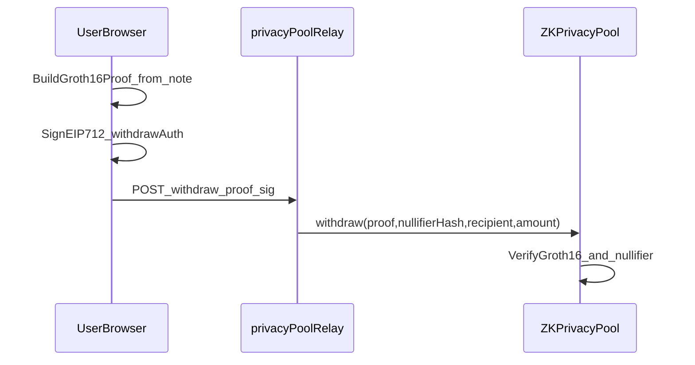

# Contracts & architecture

This page maps how SwapArc’s **layers** fit together for **developers and operators** working under **Environment & build**. It is the conceptual bridge between [Local development](local-development.md)—where you run the stack—and the product-facing ZK narrative in [PrivPay private receive (ZK privacy pool)](../concepts/privpay-private-receive-zk.md) and [PrivPay](../core-features/privpay.md). When you need HTTP request shapes, headers and relay error semantics, pair this document with [API: PrivPay](api-reference-privpay.md) and [Relayer operations](../operate/relayer-operations.md); when you need env wiring before reading paths below, use [Prerequisites & environment](../getting-started/prerequisites-and-environment.md).

## High-level architecture

SwapArc is deliberately split so user flows, off-chain orchestration and on-chain invariants stay testable in isolation while still composing into one product.

The **frontend app** carries user flows end-to-end: **`src/SwaparcApp.jsx`** orchestrates the main UI (swap, pools, PrivPay, wallet state and the surfaces that call into proofs and relays), while **`src/App.jsx`** owns **routing** and how the shell mounts that experience. That separation matters when you debug “UI thinks X but URL or provider thinks Y”; start from which layer owns navigation versus feature orchestration.

**API routes** sit beside the Vite runtime and cover **profile** data, **payment orchestration** (including recurring flows that hit the server), and **relay actions** where the privacy pool path delegates signing or validation to trusted infrastructure. Those routes are not decorative: they enforce allowlists, deadlines and rate limits that the browser cannot safely enforce alone.

**On-chain contracts** implement **swap and liquidity** mechanics plus **privacy pool** operations. The ZK pool is where deposits and nullifier-gated withdrawals settle and where the verifier and pool bytecode you deploy must match what the client proves against. For how notes, nullifiers and claims fit the user story, keep [PrivPay private receive (ZK privacy pool)](../concepts/privpay-private-receive-zk.md) open; for day-to-day PrivPay usage in the app, see [PrivPay](../core-features/privpay.md).

## PrivPay ZK claim architecture

A **PrivPay ZK claim** is the moment a recipient turns **private note material** into an on-chain **withdraw** that spends a unique **nullifier** and pays a chosen **recipient** a concrete **amount**. Locally, the browser first derives witness data from the note, runs **Groth16** proving in WASM and prepares an **EIP-712** authorization that binds the relay (or user) to the intended principal and deadline. Only after those two client-side steps succeed does the app send a compact bundle to the relay, which forwards an on-chain **`withdraw`** call to **`ZKPrivacyPool`**. On-chain, the pool verifies the proof, checks the nullifier has not been spent and moves funds. If any layer disagrees on verifier wiring, pool address or artifact versions, you see verification failures rather than a clean revert story from a simple ERC-20 transfer.

Read the sequence below as the **happy path** for relay-assisted withdrawal: proof construction and typed-data signing stay in the **user browser**; the **privacy pool relay** is the hop that submits calldata to **ZKPrivacyPool** under the deployment’s safety rules.



The diagram compresses several sub-steps: **BuildGroth16Proof_from_note** covers witness generation and proving; **SignEIP712_withdrawAuth** is the authorization the relay checks before it will call **`withdraw`**. **POST_withdraw_proof_sig** stands for the HTTP surface that carries proof bytes, nullifier hash, recipient, amount and the signature material the server validates. Finally, **`withdraw(proof,nullifierHash,recipient,amount)`** is the contract entrypoint the pool exposes and **VerifyGroth16_and_nullifier** is the on-chain gate that makes double-spends impossible for the same note commitment path. When you instrument logs, tag each hop so you can tell “proof failed in browser” from “relay rejected typed data” from “pool reverted verification.”

## Key implementation areas

When you need to change behavior rather than only read architecture, the codebase clusters work into a handful of stable seams. **Frontend orchestration** lives in **`src/SwaparcApp.jsx`**. That is where UX state, contract calls and proof pipelines are wired together. The **relay endpoint** is **`api/privpay/privacy-pool-relay.js`**, which is the HTTP boundary matching **POST_withdraw_proof_sig** in the diagram. Shared **relay authentication and rate-limit core** logic is centralized in **`lib/server/privpayRelayCore.js`** so deposit and withdraw paths do not fork incompatible checks. **ZK witness and proof helpers** span **`src/utils/privpayWitness.js`**, **`src/utils/privpayProof.js`** and **`src/utils/privpayZkClaim.js`**; together they bridge note formats, circom artifacts and the claim UX. Finally, **`src/utils/privpayNoteStorage.js`** is the **note storage utility** that persists client-side note material safely enough for local testing and recovery flows without trusting the server with spend secrets.

## Contract-level withdraw interface

PrivPay claims execute against privacy pool withdraw:

```solidity
withdraw(bytes proof, bytes32 nullifierHash, address recipient, uint256 amount)
```

Treat **`proof`** as opaque calldata the verifier understands, **`nullifierHash`** as the unique spend tag for this withdrawal, **`recipient`** as the address that receives cleared funds from the pool and **`amount`** as the value aligned with the note and authorization. Any mismatch between what EIP-712 authorizes and what this tuple passes on-chain should be rejected before submission; when it is not, the pool’s verifier or balance checks are the last line of defense.

## Design constraints

**- Pool allowlist is mandatory for relay safety.** The relay must never forward arbitrary pool addresses supplied only by clients; configuration and allowlists should pin the deployed **`ZKPrivacyPool`** instances your deployment trusts.

**- Typed-data signature signer must match intended principal (recipient for withdraw, depositor for deposit).** That binding is what stops a relay from being tricked into moving value on behalf of the wrong party; withdraw authorizations expect the **recipient** identity chain to line up with product rules and deposit paths expect the **depositor** to match the funded note intent.

**- Deadline windows are enforced server-side for relay authorizations.** Even if a client clock is wrong, the relay should reject stale or far-future deadlines so replay and griefing windows stay bounded. Pair this behavior with the rate and deadline environment variables documented for operators.
